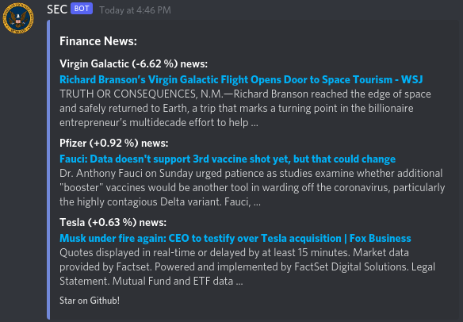

# Finance-News-Webhook
Finance webhook for discord. Keeps channel(s) up-to-date with news that may affect Stocks, Bonds, ETF's, Crypto and Commodities.
The articles are scraped from Google Finance, and any that deal with a publicly available ticker will be included in the sent message. Message are sent once per day (usually at 9am).

**Example of what it looks like**

## If you want your server channels to be added

Message me either on Discord (`Shape Shifter#1175`), or reach out via Github Issue, or email that you want to include your channels.
I will ask you how many you want, and the webhook urls will be exchanged privately.

## Contributing / Running on your own

### Requirements:

- `discord_webhook`
- `requests`
- `beautifulsoup4`

### How to run (for development)

- Make sure you have the required librarires.
- copy over `config.py.txt` as `config.py`
  - put your webhook url in array.
- run `python3 webhook.py`, this should scrape the articles and post the webhook to the channels
